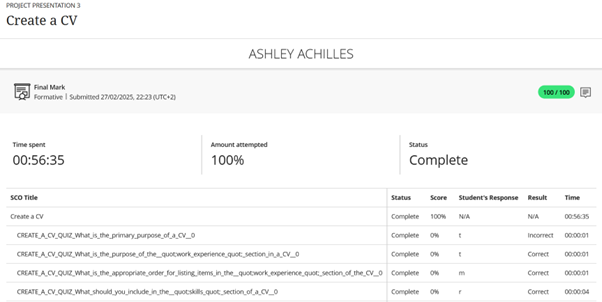
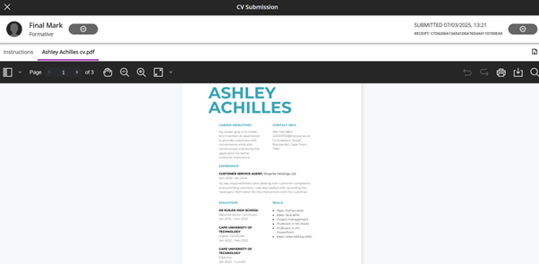

# PRP-GitHub-portfolio
---

## CAREER Development

### EVIDENCE

##### REFLECTION

**Situation:**  
For the career development section, I learnt about the difference between a job and a career, defining a career goal, and creating a career development plan.

**Task:**  
I wanted to define my career goal and create a career development plan to achieve that goal.

**Action:**  
I learnt about various careers in IT to understand which paths would help me achieve my career goal, and to create a development path accordingly.

**Result:**  
I now know which career paths to pursue and what skills I need to develop to achieve my career goal.

---

## Skills and Interests

### Evidence

#### REFLECTION

**Situation:**  
For the Skills and Interests Section, I learnt how to identify my values, what transferable skills are and how to define job specific skills.

**Task:**  
I wanted to identify my core values and learn what transferable skills I have.

**Action:**  
I learnt what soft skills I have such as problem solving and communication. I also identified my core values.

**Result:**  
I know what my soft skills are and how they can be used in different careers. I also know how my core values can help determine my career path.

---

## Personality Assessment

### Evidence

#### REFLECTION

**Situation:**  
For the Personality Assessment, I learnt about the six personality types, how to identify my personlity and how to match my personality with a career.

**Task:**  
I wanted to identify my personality and understand how it can influence my career.

**Action:**  
I identified my personality through an evaluation assessment and compared it to the six personality types.

**Result:**  
I now understand my personality better and how it can influence what career path i choose to go down.

---

## Create a CV

### Evidence

#### Reflection

**Situation:**  
For the Create a CV section, I learnt how to correctly create a cv to represemt my skills, experience and academic background.

**Task:**  
I wanted to create a cv that can be used to apply for jobs.

**Action:**  
I created a cv that accurately represents my skills, experience and academic background in a professional tone.

**Result:**  
I now have a cv that can be used to apply for jobs.

---

## CV submission

### Evidence

#### REFLECTION

**Situation:**  
We were tasked with creating and submitting a cv using what we learnt during the Create a CV section.

**Task:**  
I wanted to create and submit a professional cv.

**Action:**  
I reviewed my cv to ensure that everything was correct and submitted it.

**Result:**  
I now have a cv that accurately represents me as a potential candidate for future jobs.

---

