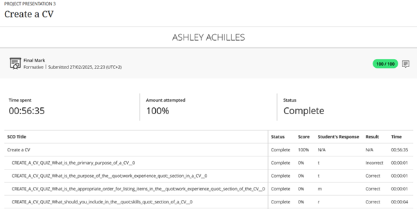
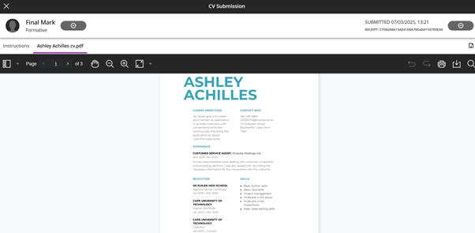
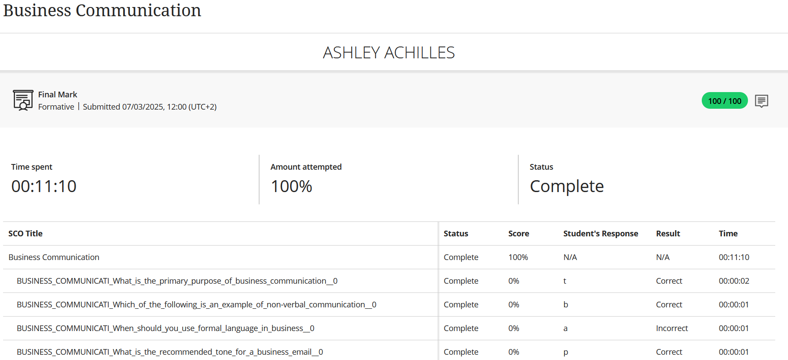

# PRP-GitHub-portfolio
---

## CAREER Development

### EVIDENCE

##### REFLECTION

**Situation:**  
For the career development section, I learnt about the difference between a job and a career, defining a career goal, and creating a career development plan.

**Task:**  
I wanted to define my career goal and create a career development plan to achieve that goal.

**Action:**  
I learnt about various careers in IT to understand which paths would help me achieve my career goal, and to create a development path accordingly.

**Result:**  
I now know which career paths to pursue and what skills I need to develop to achieve my career goal.

---

## Skills and Interests

### Evidence

#### REFLECTION

**Situation:**  
For the Skills and Interests Section, I learnt how to identify my values, what transferable skills are and how to define job specific skills.

**Task:**  
I wanted to identify my core values and learn what transferable skills I have.

**Action:**  
I learnt what soft skills I have such as problem solving and communication. I also identified my core values.

**Result:**  
I know what my soft skills are and how they can be used in different careers. I also know how my core values can help determine my career path.

---

## Personality Assessment

### Evidence

#### REFLECTION

**Situation:**  
For the Personality Assessment, I learnt about the six personality types, how to identify my personlity and how to match my personality with a career.

**Task:**  
I wanted to identify my personality and understand how it can influence my career.

**Action:**  
I identified my personality through an evaluation assessment and compared it to the six personality types.

**Result:**  
I now understand my personality better and how it can influence what career path i choose to go down.

---

## Create a CV

### Evidence

#### Reflection

**Situation:**  
For the Create a CV section, I learnt how to correctly create a cv to represemt my skills, experience and academic background.

**Task:**  
I wanted to create a cv that can be used to apply for jobs.

**Action:**  
I created a cv that accurately represents my skills, experience and academic background in a professional tone.

**Result:**  
I now have a cv that can be used to apply for jobs.

---

## CV submission

### Evidence

#### REFLECTION

**Situation:**  
We were tasked with creating and submitting a cv using what we learnt during the Create a CV section.

**Task:**  
I wanted to create and submit a professional cv.

**Action:**  
I reviewed my cv to ensure that everything was correct and submitted it.

**Result:**  
I now have a cv that accurately represents me as a potential candidate for future jobs.

---

## Business communication

### Evidence

#### REFLECTION

**Situation:** 
For Business Communication, I learnt how important proper business communication is in the workplace

**Task:** 
I wanted to learn when I should use formal communication, the recommended tone for emails, the recommended etiquette for virtual backgrounds and non-verbal communication.

**Action:** 
I learnt when to use formal communication, what tone to use for emails, what virtual backgrounds and how to read non-verbal communication.

**Result:**
I now know how to use proper communication in the business environment.

---

## Interview skills

### Evidence

#### Reflection

**Situation:** 
For Interview skills, I learnt about the importance of interview skills and how to answer interview questions properly.

**Task:**
I wanted to learn about the CAR (Context, Action, Result) method and the best ways to answer interview questions.

**Action:** 
I learnt how to apply the CAR method to interview questions, how to correctly answer interview questions such as “what is your greatest weakness?” and “Tell me about yourself”. I also learnt about the importance of researching a company before an interview.

**Result:** 
I gained the appropriate interview skills to prepare me for any interview.

---

## Mock interview

### Evidence

https://github.com/222320753/222320753AshleyAchilles

#### Reflection

**Situation:**
For the mock interview, I had to record a mock interview to show the interview skills I had learnt.

**Task:**
I had to record a mock interview where I had to answer questions in a simulated interview environment.

**Action:**
I recorded my mock interview where I applied the CAR method and answered questions like “What is your greatest weakness?” and “Tell me about yourself”. I then uploaded the video to my GitHub profile.

**Result:**
I recorded a mock interview where I displayed the interview I learnt.

---

## Professional networking

### Evidence

#### Reflection

**Situation:**
For professional networking, I learnt about the importance of professional networking and what common mistakes to avoid in professional networking.

**Task:**
I wanted to learn about the importance of professional networking, the golden rule of networking and common mistakes to avoid when networking.

**Action:**
I learnt how to take the first steps towards professional networking, the importance of professional networking, the golden rule of professional networking and what the primary purpose of professional networking.

**Result:**
I learnt the necessary skills to start professional networking.

---

## Workplace etiquette

### Evidence

#### Reflection

**Situation:**
For Workplace etiquette, I learnt about how to properly conduct myself in the workplace.

**Task:**
I wanted to learn about the aspects of workplace etiquette such as:
What time to arrive for meetings
How to deal with work emails that have rude or offensive tones
How to deal with confidential information

**Action:**
I learnt how to respond to emails with rude or offensive, when to arrive for meetings and how to deal with confidential information in the workplace.

**Result:**
I gained the necessary workplace etiquette knowledge.

